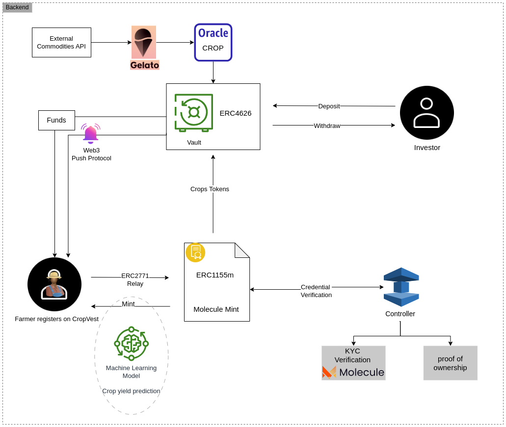

# CropVest

### Sustainable Satellite-based Agriculture Financing Protocol
#### Goal: Farmers anywhere verify their crops to Wholesalers and Investors to receive the means to produce secure and stable food supply

## Overcoming Challenges 

### Decentralised Agriculture

#### Crop Token: Improved ERC-1155 Token Standard

Property rights to the agricultural crops can be represented by a globally transferable token that can be used as collateral.

#### Liquidity Pool: Improved ERC-4626 Tokenized Vault Standard adopted to hold NFTs as collateral as well as ERC-20 funds

Stablecoins as well as the crop tokens can be managed by this vault automatically for the crop lifecycle from growing until harvest and sales including potential liquidation to wholesales.

### Satellite-Based Crop Yield Prediction

The concept of using satellites to predict crop yield seems straightforward: capture field images, assess crops, measure field area, and predict yield. However, numerous challenges hinder this process, including:

#### Clouds

Frequent cloud cover due to regular rain complicates satellite image capture, making it difficult to obtain clear crop pictures.

Overcoming Clouds: Advanced image processing techniques are employed to address cloud interference, including cloud masking and compositing of multiple cloud-free images.

#### Colour

Identifying crops based on satellite imagery relies on detecting "green" fields, but this method struggles to distinguish between various green vegetation types.

Spectral Analysis: Leveraging hyperspectral and multispectral imaging, advanced spectral analysis techniques enable better differentiation of crop types.

#### Phenology

Differentiating between similar crops and understanding specific crop types (e.g., sugar vs. cassava) is challenging due to multiple crops.

Phenological Indices: Utilizing remote sensing data and temporal vegetation indices, crops at different growth stages are distinguished.

#### Area v Yield

Identifying crop areas is one step, but predicting yield involves accounting for factors like weather conditions and plant health.
Yield Models: Complex predictive models integrate weather, soil, and historical yield data to estimate crop yield based on identified areas. Therefore data from different sources was combined: , including the European Soil Data Centre (ESDAC), Sentinel satellite data, and weather information. This amalgamation serves to enhance the precision and reliability of crop yield forecasts but increases complexity.

